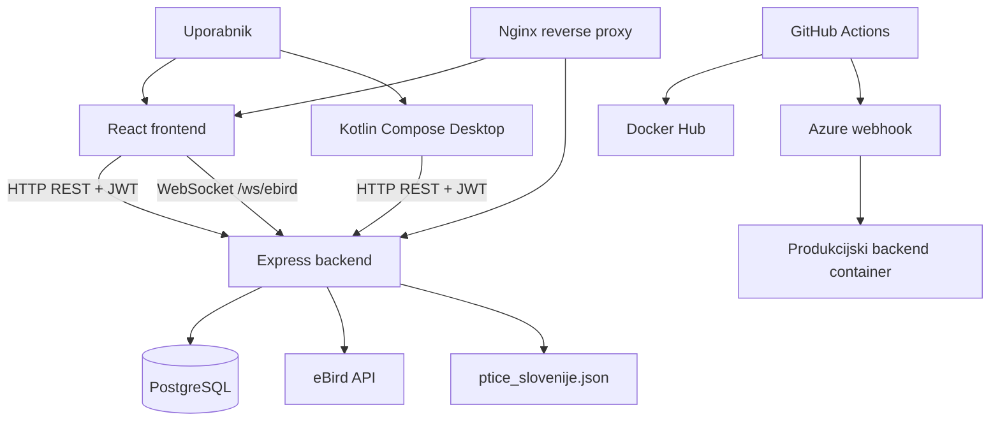

# 1. Projektne specifikacije

## 1.1 Opredelitev namena študentskega projekta

Namen projekta FlySight je razvoj prototipa digitalnega dvojčka za podatke o pticah v Sloveniji. Pri projektu smo izhajali iz tega, da so podatki o vrstah ptic, lokacijah in opažanjih razpršeni med različnimi viri. Del podatkov pride iz DOPPS oziroma ptice.si, del iz eBird API-ja, del pa nastane z ročnim vnosom uporabnika ali z generiranjem testnih zapisov za demonstracijo.

FlySight te vire poveže v en sistem. Podatki se shranijo v PostgreSQL bazo, uporabnik pa jih lahko pregleduje na zemljevidu, filtrira in dopolnjuje z lastnimi opažanji. Administratorski del je namenjen predvsem upravljanju virov, generiranju testnih podatkov in osnovnemu pregledu podatkovnih tabel.

### Skupine uporabnikov in njihove potrebe

| Skupina uporabnikov | Potrebe |
| --- | --- |
| Običajni uporabniki oziroma opazovalci ptic | Prijava v sistem, pregled opažanj, iskanje po vrstah in lokacijah, dodajanje lastnih opažanj, shranjevanje priljubljenih ptic |
| Administratorji | Pregled podatkovnih tabel, upravljanje podatkovnih virov, sprožanje uvoza ali generiranja podatkov, nadzor delovanja sistema |
| Člani razvojne ekipe | Lokalni zagon, razvoj frontenda, backenda in desktop aplikacije, testiranje API endpointov, vzdrževanje CI/CD postopka |
| Mentorji in ocenjevalci | Pregled namena projekta, zahtev, arhitekture, izvedenih funkcionalnosti in navodil za uporabo |

## 1.2 Opis rešitve

V trenutni verziji repozitorija je FlySight sestavljen iz več povezanih delov:

- React spletni vmesnik za uporabo aplikacije v brskalniku,
- Express backend API za avtentikacijo, poslovno logiko in dostop do podatkov,
- PostgreSQL baza za trajno shranjevanje podatkov,
- Kotlin Compose Desktop aplikacija za administratorska in razvojna opravila,
- CityInfra DSL modul za opis prostorske infrastrukture in izvoz v GeoJSON,
- Docker Compose okolje za lokalni zagon,
- GitHub Actions, Docker Hub in webhook skripte za CI/CD backend deployment.

Spletni vmesnik komunicira z backendom prek REST API-ja in WebSocket povezave. Backend uporablja JWT avtentikacijo, bcrypt hashiranje gesel, CORS, Helmet in rate limiting. Katalog ptic se ob inicializaciji baze naloži iz `composeApp/ptice_slovenije.json`, aktualna opažanja pa backend pridobi prek zunanjega eBird API-ja.

### Arhitektura rešitve

## 1.3 Funkcionalne zahteve projekta

### FZ-1: Registracija in prijava

Sistem mora omogočati registracijo in prijavo uporabnikov z emailom in geslom. Geslo mora biti shranjeno kot bcrypt hash. Po uspešni prijavi sistem vrne JWT token.

### FZ-2: Avtorizacija in uporabniške vloge

Sistem mora ločiti navadne uporabnike in administratorje. Navadni uporabniki imajo dostop do osnovnih uporabniških strani, administratorji pa še do administracije, podatkovnih tabel in podatkovnih virov.

### FZ-3: Pregled opažanj na zemljevidu

Sistem mora prikazati opažanja ptic na interaktivnem zemljevidu. Opažanje mora vsebovati vrsto ptice, lokacijo, koordinate, datum, število osebkov in vir podatkov.

### FZ-4: Filtriranje podatkov

Sistem mora omogočati filtriranje opažanj po vrsti ptice, lokaciji, datumu in viru podatkov. Filtri se uporabijo pri poizvedbi na backendu.

### FZ-5: Dodajanje osebnih opažanj

Prijavljen uporabnik mora lahko dodati lastno opažanje. Pri tem izbere ali vnese vrsto ptice, datum, število osebkov, ime lokacije in koordinate.

### FZ-6: Upravljanje osebnega profila

Uporabnik mora imeti možnost pregleda in urejanja profila, vključno z imenom, emailom, opisom, lokacijo in po potrebi geslom.

### FZ-7: Priljubljene ptice

Uporabnik mora imeti možnost dodati vrsto ptice med priljubljene in jo kasneje odstraniti.

### FZ-8: eBird integracija

Sistem mora omogočati pridobivanje aktualnih eBird opažanj in hotspotov za Slovenijo. Podatki se pridobijo prek eBird API-ja in se normalizirajo v obliko, uporabno za frontend.

### FZ-9: DOPPS katalog ptic

Sistem mora uporabljati katalog ptic iz `ptice_slovenije.json`, ki vsebuje družine in vrste ptic. Katalog se ob inicializaciji baze shrani v tabele `bird_family` in `bird_info`.

### FZ-10: Administracija podatkovnih virov

Administrator mora imeti možnost pregledati in urejati podatkovne vire `ebird`, `dopps`, `generated` in `cityinfra`. Za vsak vir se hranijo nastavitve, kot so regija, največje število rezultatov, število dni in čas zadnje sinhronizacije.

### FZ-11: Generiranje testnih opažanj

Administrator mora imeti možnost generirati testna opažanja za demonstracijo in testiranje sistema.

### FZ-12: Generični CRUD nad dovoljenimi tabelami

Backend mora omogočati branje, dodajanje, urejanje in brisanje zapisov samo za vnaprej dovoljene tabele. Imena tabel in zapisljiva polja morajo biti omejena na seznam v kodi.

### FZ-13: CityInfra DSL

Projekt mora vsebovati DSL modul, ki podpira opis mestne infrastrukture, leksikalno analizo, parsanje, semantično validacijo in izvoz v GeoJSON.

### FZ-14: CI/CD za backend

Sistem mora vsebovati CI/CD postopek za backend. Ob pushu na vejo `master` se mora zgraditi Docker slika backenda, objaviti na Docker Hub in prek podpisanega webhooka sprožiti posodobitev backend containerja na Azure VM.

## 1.4 Sistemske zahteve

### Lokalni zagon

| Zahteva | Namen |
| --- | --- |
| Docker in Docker Compose | Zagon frontenda, backenda, PostgreSQL baze in Nginx proxyja |
| `.env` datoteka | Konfiguracija baze, JWT skrivnosti, CORS in eBird API ključa |
| Port `80` | Dostop do aplikacije prek Nginx proxyja |
| Port `5432` | Lokalni dostop do PostgreSQL baze |

### Lokalni razvoj brez Dockerja

| Del | Zahteve |
| --- | --- |
| Frontend | Node.js, npm, Vite |
| Backend | Node.js, npm, TypeScript |
| Desktop | JDK, Gradle wrapper, Kotlin |
| Baza | PostgreSQL ali Docker PostgreSQL container |

### Produkcijsko okolje

| Del | Opis |
| --- | --- |
| Azure VM | Linux strežnik za zagon produkcijskega backend okolja |
| Docker Hub | Registry za backend Docker sliko |
| GitHub Actions | Avtomatski build in push slike |
| Webhook | Podpisan endpoint za deployment |
| `systemd` | Stalno izvajanje webhook strežnika |

## 1.5 Nefunkcionalne zahteve

| Zahteva | Opis |
| --- | --- |
| Varnost | JWT, bcrypt, CORS, Helmet, rate limiting, zaščiten webhook |
| Vzdržljivost | Docker Compose omogoča ponovljiv zagon okolja |
| Razširljivost | Podatkovni viri so ločeni v tabeli `data_source_settings` |
| Sledljivost | CI/CD slike imajo tag `latest` in tag z Git commit SHA |
| Prenosljivost | Projekt se lahko zažene lokalno in na strežniku |
| Modularnost | Frontend, backend, desktop, DSL in DevOps del so ločeni po mapah |
